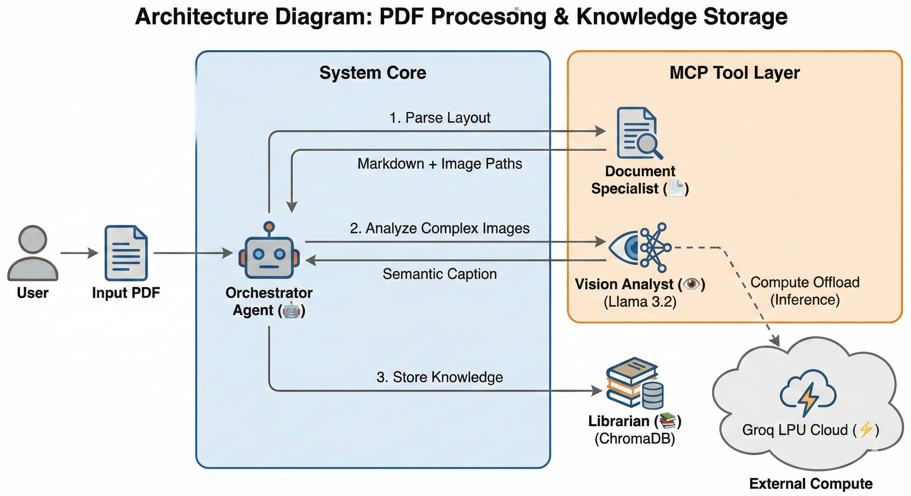

# 🧠 Agentic RAG: Multi-Modal PDF Extraction Pipeline


> **A "Zero-Cost" Enterprise-Grade RAG Pipeline built using the Model Context Protocol (MCP) pattern.**
> *Demonstrating autonomous decision-making, multi-modal analysis, and tool-use orchestration.*

---

## 🏗️ The Engineering Challenge
Traditional RAG (Retrieval-Augmented Generation) pipelines fail on complex documents. They blindly chop text into chunks, losing the context of:
1.  **Multi-Column Layouts** (Standard OCR fails here).
2.  **Visual Data** (Charts/Graphs are ignored).
3.  **Semantic Structure** (Headers vs. Footers).

**The Solution:** An **Agentic Workflow** that acts as a "Smart Scanner." Instead of passively reading, the Agent *observes* the page, *decides* if an image is complex enough to require a Vision Model, and *orchestrates* specialized tools to extract meaning.

---

## 🧩 Architecture (MCP Pattern)
This project moves away from monolithic scripts to a modular **Model Context Protocol (MCP)** inspired design. The "Brain" (Agent) is decoupled from the "Hands" (Tools).



### 🛠️ Key Technical Components

| Component | Tech Stack | Role & Engineering Decision |
| :--- | :--- | :--- |
| **The Brain** | **Groq API** (Llama 3.3 70B) | Chosen for **LPU inference speed** (300+ t/s). Handles reasoning and summarization. |
| **The Eyes** | **Groq API** (Llama 4 Vision) | Multi-modal analysis. Only triggered when the Agent detects high-value visual data (graphs/diagrams). |
| **The Parser** | **PyMuPDF / Marker** | Local deep-learning layout analysis to preserve column structure (solving the "column soup" problem). |
| **The Memory** | **ChromaDB** (Local) | Persistent vector storage for semantic retrieval. |
| **The UI** | **Streamlit** | Interactive dashboard for RAG verification and debugging. |

---

## 🤖 Agentic Workflow Logic
The core differentiator of this project is the **conditional routing logic** embedded in the orchestrator:

1.  **Ingestion:** The agent receives a PDF stream.
2.  **Classification:** It runs a lightweight local check: *Is this image just a logo (ignore) or a data chart (analyze)?*
3.  **Routing:**
    * *If Chart:* Dispatch to **Vision MCP Tool** (Cloud GPU).
    * *If Text:* Dispatch to **Parser Tool** (Local CPU).
4.  **Synthesis:** The Vision Tool's output (e.g., "This chart shows Q3 revenue up 20%") is injected back into the text stream before embedding.
5.  **Chunking:** Markdown-aware splitting ensures tables and headers stay intact.

---

## 🚀 Quick Start

### 1. Clone & Install
```bash
git clone [https://github.com/SubikshaDevi/PDF-Extractor-Agentic-AI.git](https://github.com/SubikshaDevi/PDF-Extractor-Agentic-AI.git)
cd PDF-Extractor-Agentic-AI
pip install -r requirements.txt
